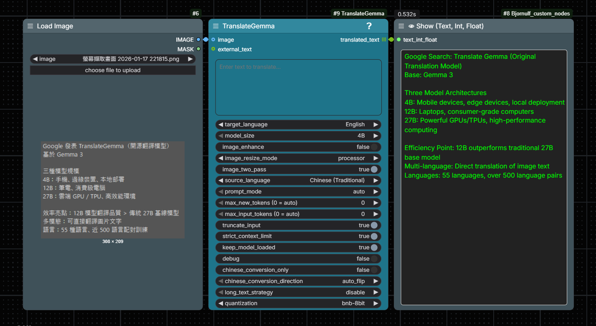

# ComfyUI-TranslateGemma

A ComfyUI integration for TranslateGemma — Google's new open source translation model family built on Gemma 3. It supports 55 languages, multimodal image-to-text translation, and efficient inference from mobile (4B), and local (12B) to cloud (27B).

<p align="center">
  
</p>

 [TranslateGemma: A new suite of open translation models](https://blog.google/innovation-and-ai/technology/developers-tools/translategemma/)

 ---

**01/2026 update**:

- Added `chinese_conversion_only` + `chinese_conversion_direction` for fast Simplified↔Traditional conversion via OpenCC (no model load).
- Added `max_new_tokens=0` / `max_input_tokens=0` as **Auto** token budgeting (context-aware).
- Added `long_text_strategy` (`disable` / `auto-continue` / `segmented`) to mitigate “early stop” on long documents.
- Added a node UI `?` help modal and `0 = auto` labels for max token widgets.

---

## Table of Contents

- [Features](#features)
- [Installation](#installation)
- [Hugging Face Access (Gated Models)](#hugging-face-access-gated-models)
- [Model Storage Location](#model-storage-location)
- [Node: TranslateGemma](#node-translategemma)
  - [Inputs](#inputs)
  - [Outputs](#outputs)
- [Usage Notes](#usage-notes)
  - [Text: Auto Detect](#text-auto-detect)
  - [Image Translation Requires Source Language](#image-translation-requires-source-language)
  - [Image Preprocessing (896×896)](#image-preprocessing-896896)
  - [Notes on Chinese Variants](#notes-on-chinese-variants)
  - [Chinese Conversion-Only Mode (TG-038)](#chinese-conversion-only-mode-tg-038)
  - [Long Text Strategy (TG-050)](#long-text-strategy-tg-050)
  - [Language Code Normalization](#language-code-normalization)
- [Default Settings (TG-032)](#default-settings-tg-032)
- [Performance Tips](#performance-tips)
- [VRAM Notes (Native Models)](#vram-notes-native-models)
- [Security / Reproducibility Notes](#security--reproducibility-notes)
- [License](#license)

## Features

- Text translation across 55 languages
- Model size selection: 4B / 12B / 27B
- First-run auto download via Hugging Face (requires accepting Gemma terms)
- Flexible inputs: built-in text box + external string input
- Optional image input: translate text found in images (multimodal)
- Chinese conversion-only mode: Simplified↔Traditional conversion via OpenCC without loading the model (TG-038)

## Installation

### Option A: ComfyUI-Manager

1) Open ComfyUI-Manager.
2) Search for `TranslateGemma`.
3) Install and restart ComfyUI.

### Option B: Manual

1) Clone into your ComfyUI `custom_nodes` directory (from your ComfyUI root):

```bash
cd custom_nodes
git clone https://github.com/rookiestar28/ComfyUI-TranslateGemma.git
```

2) Install dependencies:

```bash
cd ComfyUI-TranslateGemma
pip install -r requirements.txt
```

3) Restart ComfyUI.

## Hugging Face Access (Gated Models)

TranslateGemma repos are gated under the Gemma terms.

1) Visit the model page and accept the license terms:

- `google/translategemma-4b-it`
- `google/translategemma-12b-it`
- `google/translategemma-27b-it`

1) Authenticate (recommended):

```bash
hf auth login
```

Alternatively, set one of these environment variables for the ComfyUI process:

- `HF_TOKEN`
- `HUGGINGFACE_HUB_TOKEN`

1) Restart ComfyUI after changing authentication.

## Download Troubleshooting (Hugging Face)

If the model download stalls at `Fetching ...` or fails with connection errors, it is usually not a node bug.
Common causes: unstable network, corporate firewall/proxy, DNS issues, or regions where `huggingface.co` is blocked
(some China networks).

Things to try:

- Retry: downloads are resumable; restarting ComfyUI often continues where it left off.
- Proxy: set `HTTP_PROXY` / `HTTPS_PROXY` for the ComfyUI process.
- Mirror endpoint (community): set `HF_ENDPOINT` (or `HUGGINGFACE_HUB_ENDPOINT`) to a mirror URL, then restart ComfyUI.
- Offline/manual: download the model on a machine that can reach Hugging Face, then copy the downloaded folder into the
  model cache directory (see **Model Storage Location** below) and restart ComfyUI.

Notes:

- Community mirrors are not official; availability and correctness are not guaranteed.
- If you see `401/403/gated/forbidden`, you likely need to accept the license and/or set `HF_TOKEN`.

## Model Storage Location

Models are stored under ComfyUI's models directory in a per-repo folder:

- Preferred: `ComfyUI/models/LLM/TranslateGemma/<repo_name>/`
- Fallback (legacy): `ComfyUI/models/translate_gemma/<repo_name>/`

- `ComfyUI/models/LLM/TranslateGemma/translategemma-4b-it/`
- `ComfyUI/models/LLM/TranslateGemma/translategemma-12b-it/`
- `ComfyUI/models/LLM/TranslateGemma/translategemma-27b-it/`

## Node: TranslateGemma

Category: `text/translation`

### Inputs

| Name | Type | Description |
|------|------|-------------|
| `text` | STRING | Built-in text input (multiline). Ignored when `external_text` is connected. Empty/whitespace returns empty output. |
| `external_text` | STRING | When connected, **overrides** `text` (even if empty). Intended for chaining from other nodes. |
| `image` | IMAGE | If connected, uses multimodal path to translate text from the image. Requires explicit `source_language` (Auto Detect is not supported for images). |
| `image_enhance` | BOOLEAN | Mild contrast/sharpening to help small text visibility; may introduce artifacts (default: `false`). |
| `image_resize_mode` | COMBO | `letterbox` (preserve aspect ratio, recommended) / `processor` (official resize, may stretch) / `stretch` (force 896×896, may distort). Default: `letterbox`. |
| `image_two_pass` | BOOLEAN | Extract text from image first, then translate extracted text (more accurate, slower). Default: `true`. |
| `target_language` | COMBO | Translation target language. Does not affect `chinese_conversion_only=true`. |
| `source_language` | COMBO | Auto Detect is supported for text only. Images require explicit source language. Default: Auto Detect. |
| `model_size` | COMBO | 4B (fastest) / 12B / 27B trade-off (speed vs quality vs VRAM). Gated repos require HF authentication. See VRAM Notes below for rough estimates. |
| `prompt_mode` | COMBO | `auto` (structured first, fallback to plain) / `structured` (fail if unavailable) / `plain` (instruction only). Default: `auto`. |
| `max_new_tokens` | INT | Maximum output tokens. `0` = Auto (based on input length and remaining context budget). Also clamped by the model context window. Default: 512. |
| `max_input_tokens` | INT | Input truncation limit. `0` = Auto (reserve room for output within context). Too low can break multimodal inputs/templates. Default: 2048. |
| `truncate_input` | BOOLEAN | Truncate input if it exceeds `max_input_tokens`. Disable may cause OOM. Default: `true`. |
| `strict_context_limit` | BOOLEAN | Clamp output so input+output stays within model context window. Default: `true`. |
| `keep_model_loaded` | BOOLEAN | Keep model in memory for faster repeated use; may keep VRAM allocated. Default: `true`. |
| `debug` | BOOLEAN | Enable debug logging. Sensitive data redacted by default; set `TRANSLATEGEMMA_VERBOSE_DEBUG=1` for full details. Default: `false`. |
| `chinese_conversion_only` | BOOLEAN | OpenCC conversion only (Simplified↔Traditional) without loading the model. Text-only; image not supported. Default: `false`. |
| `chinese_conversion_direction` | COMBO | `auto_flip` (detect and flip variant) / `to_traditional` (force s→t) / `to_simplified` (force t→s). Default: `auto_flip`. |
| `long_text_strategy` | COMBO | `disable` (default single-call) / `auto-continue` (continue if model stops early) / `segmented` (paragraph-by-paragraph). Default: `disable`. |

### Outputs

| Name | Type | Description |
|------|------|-------------|
| `translated_text` | STRING | Translated text |

## Usage Notes

### Text: Auto Detect

TranslateGemma's official chat template requires an explicit `source_lang_code`.
When `source_language=Auto Detect`, this node performs a best-effort local detection for text inputs.
If you see wrong-language behavior, pick the `source_language` explicitly.

### Image Translation Requires Source Language

For images, `source_language=Auto Detect` is not supported (no OCR pre-pass). Select the correct `source_language`.

### Image Preprocessing (896×896)

For image translation, the node supports multiple preprocessing modes via `image_resize_mode`:

- `letterbox` (default): preserve aspect ratio (no stretching) by padding, then resize
- `processor`: rely on the official Gemma3 image processor resize to **896×896** (may stretch)
- `stretch`: force resize to **896×896** (may distort)

If small text is missed, try enabling `image_enhance=true` to apply mild pixel-only enhancement (TG-037).

**Enhancement tuning (experimental)**:

- `TRANSLATEGEMMA_IMAGE_ENHANCE_MODE`: `gentle` (default) or `legacy`
- `TRANSLATEGEMMA_IMAGE_ENHANCE_CONTRAST`: contrast factor (default `1.10`)
- `TRANSLATEGEMMA_IMAGE_ENHANCE_SHARPNESS`: sharpness factor (default `1.10`)
- `TRANSLATEGEMMA_AUTO_MAX_NEW_TOKENS_MAX`: optional hard cap for `max_new_tokens=0` (Auto) to limit long-form outputs. If unset, Auto is only limited by context budget + other safeguards.

When `debug=true`, the node prints the path of the preprocessed temporary PNG and keeps it for inspection.

Additionally, when `debug=true`, the node saves intermediate images under `debug/`:
- `resize_mode` + `enhance_mode` prefixed files
- both the resize-only and enhance-applied variants (when enabled)

Note: For image translation, `max_input_tokens` values that are too small can truncate the model’s visual tokens and cause unrelated outputs. The node enforces a safe minimum when truncation is enabled.

### Notes on Chinese Variants

For better Traditional Chinese output consistency, the node maps:

- Chinese (Simplified) -> `zh`
- Chinese (Traditional) -> `zh-Hant`

When `source_language=Auto Detect`, the node will try to distinguish Simplified vs Traditional Chinese:

- Region hints (when available): `zh_TW/zh_HK/zh_MO` -> `zh_Hant`, `zh_CN/zh_SG/zh_MY` -> `zh`
- Character-variant heuristic: counts common simplified/traditional characters and picks `zh_Hant` only when the signal is strong

If the text is too short or ambiguous, Auto Detect may still resolve to `zh`. For guaranteed behavior, select the desired `source_language` explicitly.

Tip: If your input is Simplified Chinese but you want Traditional output, set `source_language=Auto Detect` (or `Chinese (Simplified)`) and `target_language=Chinese (Traditional)`.

If you still see mixed Simplified/Traditional output when targeting Traditional Chinese, you can enable a best-effort post-edit conversion using OpenCC:

- Install: `pip install opencc-python-reimplemented`
- Default behavior: when `target_language=Chinese (Traditional)` the node will convert Simplified → Traditional if OpenCC is available
- Disable: set `TRANSLATEGEMMA_TRADITIONAL_POSTEDIT=0`

### Chinese Conversion-Only Mode (TG-038)

For workflows that only need **script conversion** (Simplified ↔ Traditional) without translation, enable `chinese_conversion_only=true`. This mode:

- Uses OpenCC for fast, deterministic conversion
- **Does not load any translation model** (no GPU/VRAM required)
- Returns converted text immediately with minimal latency
- Does **not** require `target_language` to be a Chinese variant (direction is controlled separately)

**Direction selector** (`chinese_conversion_direction`):

- `auto_flip` (default): Auto-detect input variant and convert to the **opposite** script
  - Input Simplified → output Traditional
  - Input Traditional → output Simplified
  - Returns an error if input is ambiguous (ask user to force direction)
- `to_traditional`: Force Simplified → Traditional (`s2t`)
- `to_simplified`: Force Traditional → Simplified (`t2s`)

**Requirements:**

- Install OpenCC: `pip install opencc-python-reimplemented`

**Limitations:**

- Text-only: if `image` is connected, returns an error (use normal translation mode for images)
- No cross-language translation (e.g., English → Chinese still requires the model)
- `auto_flip` may fail on short/ambiguous inputs; use forced direction in those cases

**When to use:**

- You have Chinese text and only need to change the script variant
- You want to avoid model download/load overhead
- You need deterministic, reproducible output (no LLM randomness)

### Long Text Strategy (TG-050)

For long texts, the model may stop early (emitting `<end_of_turn>`) before completing the translation. The `long_text_strategy` option provides two approaches:

**`disable`** (default): Standard single-call behavior. Suitable for most inputs.

**`auto-continue`** (also accepts `auto_continue`): Best-effort continuation when the model stops early on long input.

- Only triggers when: input is long (≥512 tokens), model stopped via `<end_of_turn>`, and input was not truncated.
- Prompts the model to continue the translation (up to 2 additional rounds).
- Uses overlap trimming to avoid duplicated text at continuation boundaries.
- Trade-off: may increase latency (2–3× model calls), but improves completeness for long texts.

**`segmented`**: Translate paragraph-by-paragraph.

- Splits input by blank lines (preserves original separators).
- Translates each paragraph in a separate model call.
- Reassembles with original blank lines preserved.
- Trade-off: slower (N model calls for N paragraphs), but handles very long documents and preserves paragraph structure.

**When to use:**

| Scenario                                 | Recommended     |
|------------------------------------------|-----------------|
| Short/medium text (<2000 chars)          | `disable`       |
| Long text that sometimes truncates early | `auto-continue` |
| Very long document with many paragraphs  | `segmented`     |
| Speed is critical                        | `disable`       |

**Recommended settings for long documents:**

- Set `max_input_tokens=0` and `max_new_tokens=0` (Auto) so the node stays context-aware.
- If you see early stops with incomplete output: try `long_text_strategy=auto-continue`.
- For very long documents or many paragraphs: try `long_text_strategy=segmented` (more robust, but slower).

**Limitations:**

- Text-only for v1 (image path not affected).
- `segmented` mode has higher latency for many-paragraph documents.
- `auto-continue` continuation quality depends on model; may occasionally repeat or diverge.

### Language Code Normalization

The node accepts both `_` and `-` variants for language codes (e.g., `zh_Hant` and `zh-Hant`). Internally, codes are normalized to match the official TranslateGemma template format.

If an unsupported language is passed, the node prints a warning and defaults to English. Set `TRANSLATEGEMMA_STRICT_LANG=1` to raise an error instead.

## Default Settings (TG-032)

The following are the authoritative default values for node inputs:

| Setting | Default | Notes |
|---------|---------|-------|
| `model_size` | `4B` | Smallest, fastest |
| `max_new_tokens` | `512` | Use `0` for auto-sizing |
| `max_input_tokens` | `2048` | Input truncation limit (`0` = Auto) |
| `keep_model_loaded` | `true` | Avoids reload overhead |
| `truncate_input` | `true` | Prevents OOM on long texts |
| `debug` | `false` | Enable for diagnostics |
| `image_resize_mode` | `letterbox` | Preserves aspect ratio |
| `image_enhance` | `false` | Enables contrast/sharpening |
| `image_two_pass` | `true` | Extract then translate |
| `chinese_conversion_only` | `false` | OpenCC conversion without model |
| `chinese_conversion_direction` | `auto_flip` | Auto-detect and flip variant |
| `long_text_strategy` | `disable` | Single-call (no continuation) |

## Performance Tips

- Leave `keep_model_loaded=true` for repeated use (avoids reload time).
- Use the 4B model if you are unsure about hardware limits.
- First run is slower due to download and weight initialization.

## VRAM Notes (Native Models)

- Rough starting point (varies by GPU, dtype, drivers, and context length):
  - 4B model: ~12 GB
  - 12B model: ~27 GB
  - 27B model: ~56 GB

## Security / Reproducibility Notes

### Remote Code Policy (TG-026)

- The loader attempts `trust_remote_code=False` first and only falls back to `True` if required.
- Set `TRANSLATEGEMMA_ALLOW_REMOTE_CODE=0` to deny remote code entirely (fails if code is needed).
- Set `TRANSLATEGEMMA_REMOTE_CODE_ALLOWLIST=google/translategemma-4b-it,google/translategemma-12b-it` to allow only specific repos.

### Revision Pinning

- You can pin a specific revision for reproducibility via `TRANSLATEGEMMA_REVISION=<commit-or-tag>`.

### Debug Privacy (TG-028)

- By default, `debug=true` redacts sensitive data (user text content, full filesystem paths).
- Set `TRANSLATEGEMMA_VERBOSE_DEBUG=1` to enable full diagnostics (for troubleshooting).

### Download Recovery

- If a download is interrupted, the loader auto-resumes on next run.
- If corruption persists, delete the model folder under `ComfyUI/models/LLM/TranslateGemma/` and retry.

## License

This repository is licensed under the MIT License (see `LICENSE`). TranslateGemma model weights are governed by Google's Gemma Terms of Use.
